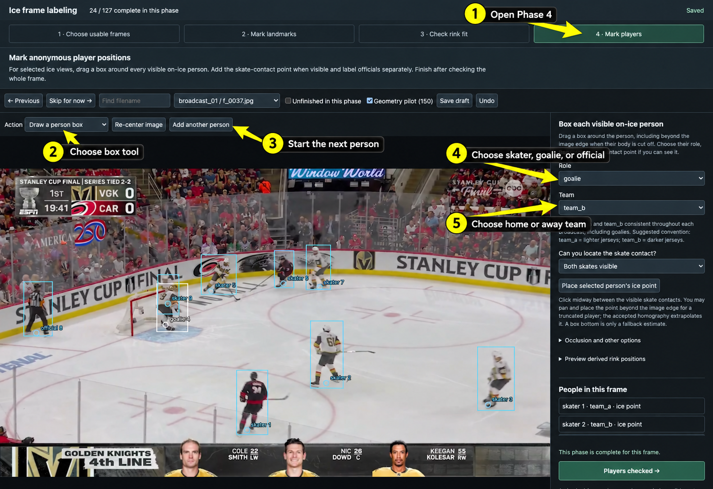
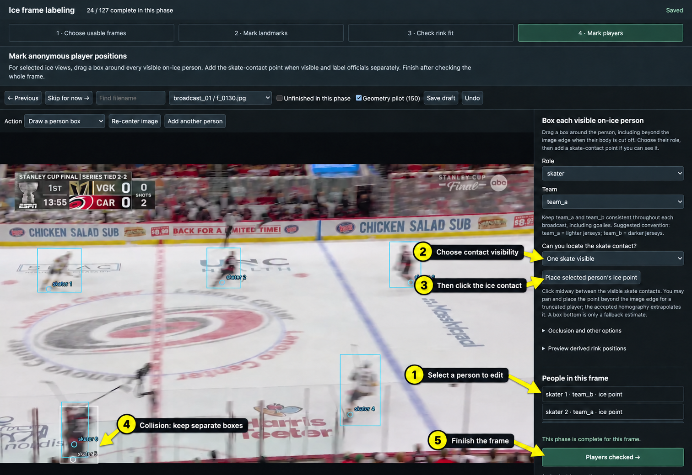

# Phase 4: Label Players

The goal is to mark where every **visible on-ice person** is located.

## Draw and identify people

Follow the numbered arrows:

1. Open **4 · Mark players**.
2. Choose **Draw a person box**, then drag a box around one person.
3. Choose `skater`, `goalie`, or `official` under **Role**. (Can use keyboard shortcuts S, G, and R)
4. Choose the person's team under **Team**. (Can use keyboard shortcuts A and B. Officials have no team)
5. Use **Add another person** before drawing the next box. Use backspace to delete a selected box.

## Add ice points and finish

1. Select a person from **People in this frame**.
2. Choose their skate-contact visibility.
3. Click **Place selected person's ice point**, then click where they touch the
   ice. The point may be outside the image; eyeball its location.
4. Keep separate boxes for players who overlap.
5. After checking the whole frame, click **Players checked →**. Use **Skip for
   now** or **Save draft** if the frame is unfinished.

The selected box is white; other boxes are blue. Select a person from **People
in this frame** to edit them. Use Backspace to delete a selected person box.

## What to label

For each visible on-ice person:

1. Draw one bounding box.
   - The box may extend outside the image.
   - If players collide or overlap, give each player a separate box.
2. Choose a role:
   - `skater`
   - `goalie`
   - `official` for referees and linespeople
3. Choose a team:
   - `team_a`: home team, colored jersey
   - `team_b`: away team, white jersey
   - Referees are `official`, not team_a or team_b.
4. Place the player ice point where the person touches the ice.
   - Upright player: midway between the skates.
   - Sitting or lying down: use the main point where their body touches the ice.
   - The point may be outside the image. Eyeball the likely contact location.
5. Set contact visibility:
   - `both`: both skates are visible
   - `one`: one skate is visible
   - `estimated`: the contact location is inferred
   - `hidden`: no trustworthy contact point is visible; leave the point empty
   - `uncertain`: a point is present, but its accuracy is unclear. You will likely not use this option.

Players may hide one another during a collision. Mark every player who is at
least partly visible, even when their boxes overlap.

A broadcast overlay may claim a player is present even when the player cannot be
seen—for example, after falling behind the boards. If the player is completely
invisible, **do not mark them**.
